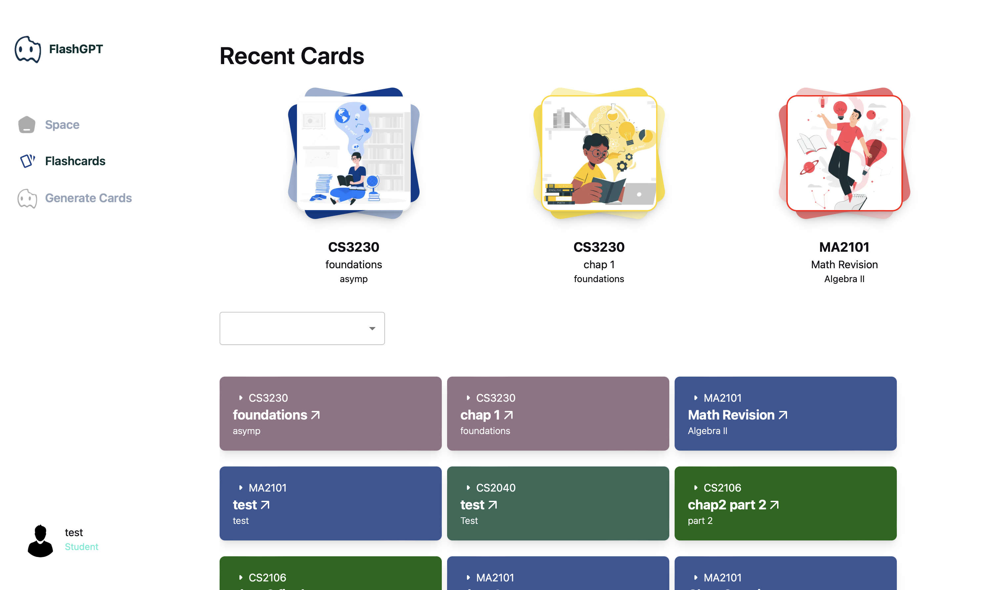
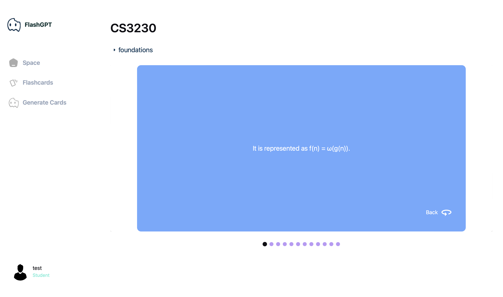

FlashGPT is your flashcard writing buddy, generating flashcards straight from your lecture notes, slides or textbook. With the power of GPT, FlashGPT is able to generate flashcards in an instant, so that you do not have to spend time manually creating them and can go straight into revision. 

- Try out FlashGPT today [here](https://flashgpt.vercel.app/)! 🤩

## Inspiration
Studying with flashcards can be one of the most efficient ways to memorise content. However, as busy students, we're too busy (and lazy) to create flashcards, so why not ask SOTA LLMs like GPT to do it for us? The time-consuming nature of flashcard creation inspired us to create a platform that is able to generate flashcards directly from notes, slides, etc, within seconds. Through FlashGPT, we hope students can go straight to revision, cutting out the hassle of manually creating flashcards.

## What it does
FlashGPT takes pdf files from the user and turns them into a deck of flash cards for users to instantly use for their revision. FlashGPT parses the user's pdf files in the backend and sends the extracted text data to OpenAI's GPT model, where it is prompted to return data for the flashcards. The flashcards are stored on sanity.io, which users can access through FlashGPT.

## Collaborators
- Kurt: [Github](https://github.com/Kurtyjlee) | [Porfolio](https://portfolio-kurt-lee.vercel.app)
- Siyuan: [Github](https://github.com/lsyurea) | [Portfolio](https://lsyurea.github.io/portfolio-v2)

## Other links
- [Devpost](https://devpost.com/software/flashgpt)
- [Figma](https://www.figma.com/file/YddVXz77XWcty9HwPBNJlQ/Frontend-Mockup-(FlashGPT)?type=design&node-id=102%3A61&mode=design&t=Suj8BBgDpbiSibRg-1)
- [Hack n Roll Slides](https://www.canva.com/design/DAF6edy_3Q0/8simEphXDG3gcobS8aYP0g/watch?utm_content=DAF6edy_3Q0&utm_campaign=designshare&utm_medium=link&utm_source=editor)

## Features

Generate flashcards from your notes and slides in an instant

Store your flashcards and review them anytime.

Review your flashcards

Keep track of your progress.

